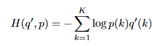
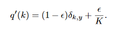
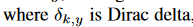
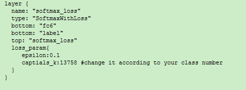
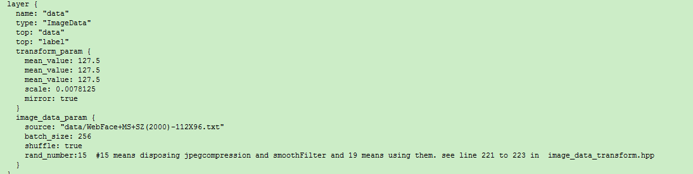

# caffe implementation of label-smoothing regularization. 

### Label-smoothing regularization（LSR）
 A mechanism to regularize the classifier layer by estimating the marginalized effect of label-dropout during training.
 
 
 
 
 
### Usage

### Reference 
[Rethinking the Inception Architecture for Computer Vision](https://www.cv-foundation.org/openaccess/content_cvpr_2016/papers/Szegedy_Rethinking_the_Inception_CVPR_2016_paper.pdf)

[caffe](https://github.com/BVLC/caffe)

Thanks to all the contributors of [sphereface](https://github.com/wy1iu/sphereface) and [Rethinking the Inception Architecture for Computer Vision](https://www.cv-foundation.org/openaccess/content_cvpr_2016/papers/Szegedy_Rethinking_the_Inception_CVPR_2016_paper.pdf)
 
## Others 
### Data augmentation
There are 7 types of data augmentation (shift, zoomImg,  rotateImg, modHSV, modRGB,  JpegCompression , smoothFilter)

And shift、zoomImg and rotateImg are so important due to the unstability of face alignment.  

## Note: 
  1. You should carefully read the code in src/caffe/layers/image_data_transform.hpp  before you use those data augmentation.
  2. JpegCompression and smoothFilter harm the performance in face recognition in my experiments。
  3. Take care of parameters in image_data_transform.hpp（line 13 to 17） because those settings may be just suitable for the face images of my experiments(112X96 images same as [sphereface](https://github.com/wy1iu/sphereface))   
## Usage

